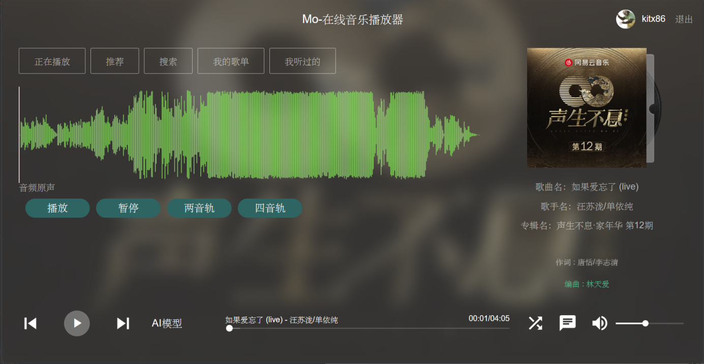
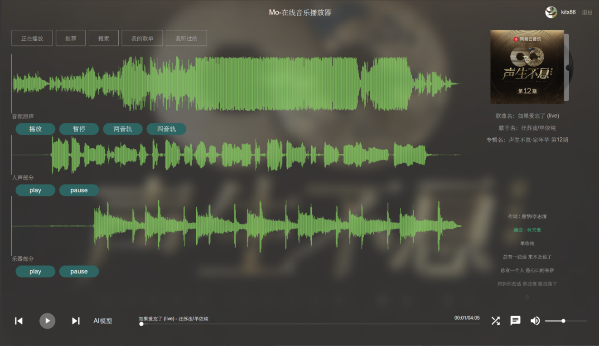

# GPro

#### 本科毕业设计

题目：基于Vue的音频源分离系统的设计与实现

语言：Javascript、Python

技术栈：Vue、Node.js、Flask

Vue前端设计实现参考：https://github.com/maomao1996/Vue-mmPlayer

Node.js：下载网易云音乐 NodeJS 版 API

#### Demo演示

在线播放的音频可视化：

播放的音频可以多个轨道分离：

#### 目前只是简单的文档描述，很多细节未作补充（有时间补上）